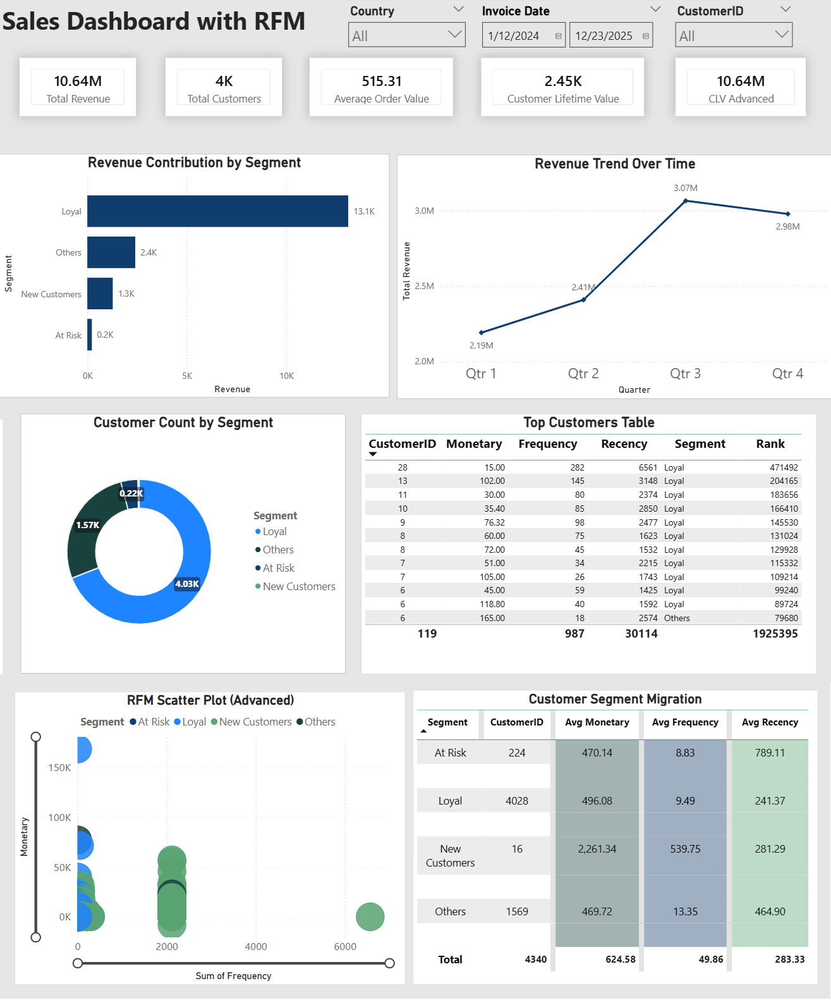

# 📊 Sales Dashboard with RFM Analysis 2024-2025 (Power BI)

## 🔍 Overview
This project showcases an interactive **Sales Dashboard** developed using **Power BI**, with a strong focus on **RFM (Recency, Frequency, Monetary) analysis** to segment customers and generate actionable business insights.

The dashboard is designed to support data-driven decision-making by answering key business questions such as:
- Who are the most valuable customers?
- Which customers are at risk of churn?
- How does revenue evolve over time?
- Which customer segments contribute the most to revenue?

---

## 🚀 Features

### 📌 Key Metrics
- **Total Revenue:** 8.91M  
- **Total Customers:** 4K  
- **Average Order Value (AOV):** 480.76 
- **Customer Lifetime Value (CLV):** 17.36M 

---

### 📊 Visualizations

- **Revenue Contribution by Segment**  
  Provides a clear comparison of revenue across customer groups:
  - Loyal  
  - New Customers  
  - At Risk  
  - Others  

- **Revenue Trend Over Time**  
  Displays quarterly revenue trends to identify growth patterns and seasonality.

- **Customer Count by Segment**  
  Donut chart showing the distribution of customers across different segments.

- **Customer Segmentation Dashboard – RFM Insights**  
  Highlights high-value customers with detailed metrics:
  - Recency_Score 
  - Monetary_Score  
  - Frequency_Score     
  - Score  
  - Segment  

- **RFM Scatter Plot (Advanced)**  
  Visual representation of customer clusters based on:
  - Frequency (X-axis)  
  - Monetary Value (Y-axis)  
  - Segment classification  

- **Customer Segment Summary Table**  
  Summarizes average behavior per segment:
  - Average Monetary  
  - Average Frequency  
  - Average Recency  

---

## 🧠 RFM Analysis Explained

RFM is a widely used customer segmentation technique based on:

- **Recency (R):** How recently a customer made a purchase  
- **Frequency (F):** How often a customer makes purchases  
- **Monetary (M):** How much a customer spends  

### Customer Segments
- 🟢 **Loyal** – High-value and frequent customers  
- 🔵 **New Customers** – Recently acquired customers  
- 🟠 **At Risk** – Customers who were active but have not purchased recently  
- ⚪ **Others** – Customers with lower engagement levels  

---

## 🛠️ Tools & Technologies

- **Power BI** – Dashboard development and data visualization  
- **Power Query** – Data cleaning and transformation  
- **Microsoft Excel** – Initial data preparation and dataset support  

---

## 🔄 Data Preparation

The dataset was processed through several steps to ensure accuracy and usability:

- Cleaned missing and inconsistent values using Power Query  
- Transformed raw transactional data into a structured format  
- Created calculated columns and measures for:
  - RFM scoring  
  - Customer segmentation  
- Aggregated data to improve dashboard performance and responsiveness  

---

## 📁 Project Structure
- **Datasets/** – Raw data used for analysis  
- **PowerBI_Dashboard/** – Final dashboard file  
- **Images/** – Dashboard screenshots  

---

## 🖼 Dashboard Preview

---

## 💡 Key Insights

- Loyal customers contribute the highest share of revenue, indicating strong retention.
- New customers show growth potential but currently generate lower revenue.
- At-risk customers represent an opportunity for targeted retention strategies.
- Revenue peaks in Q3, suggesting possible seasonal trends or successful campaigns.

---

## 📬 Author

**Aye Thida**  
Aspiring Data Analyst  
Skills: SQL • Excel • Power BI • Data Analysis

---
